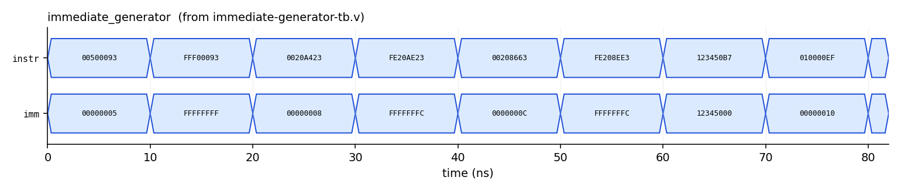
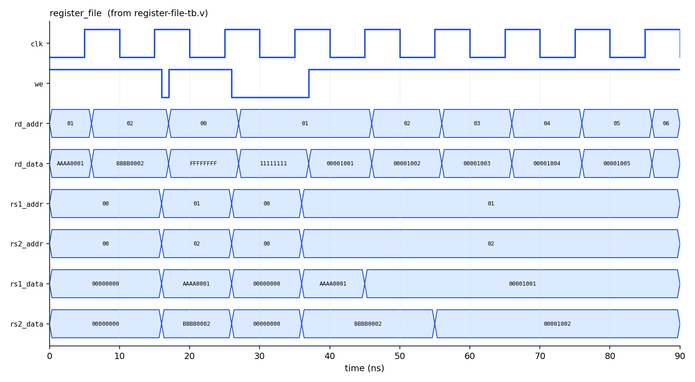

# 1. About this guide

This guide explains every Verilog component that has been written for the 32-bit RISC-V (RV32I) core, in the folders under `processor_core/components/`. For each component it covers:

1. **What it is and why the processor needs it** (the background).
2. **Its ports** (inputs and outputs).
3. **How the Verilog works**, line by line where it matters.
4. **How its testbench works** and what test vectors it applies.
5. **The expected waveform**, so you can compare it with what you see in GTKWave.
6. **How to run it.**

All eight testbenches pass with Icarus Verilog (iverilog 12). The numbers of PASS lines each testbench prints are given in the tables below, so you can check your own run against them.

> **About the waveform pictures.** The waveform images in this guide were drawn by the script `docs/gen_waveforms.py` directly from the `.vcd` files that the testbenches produce. They show the same signals and values you will see in GTKWave, but the colours and styling differ. Run the script yourself any time to regenerate them.

## 1.1 Components at a glance

| Component | Folder / file | Kind | One-line purpose | PASS lines expected |
|---|---|---|---|---|
| ALU | `alu/alu.v` | Combinational | Arithmetic, logic, shifts, comparisons | 16 |
| Branch comparator | `comparator/comparator.v` | Combinational | Decides if a branch is taken | 10 |
| Immediate generator | `immediate_generator/immediate-generator.v` | Combinational | Extracts and sign-extends immediates | 9 |
| Register (generic) | `registers/register.v` | Sequential | Stores one value with enable and reset | 5 |
| Program counter | `program_counter/program-counter.v` | Sequential | Holds the current instruction address | 5 |
| Register file | `register_files/register-file.v` | Sequential | The 32 CPU registers x0 to x31 | 3 (plus a read-back line) |
| Instruction memory | `memory_devices/instruction-memory.v` | ROM | Stores the program | 5 |
| Data memory | `memory_devices/data-memory.v` | RAM | Loads and stores data | 9 |

The `cache/` folder is empty on purpose. A cache is not part of an RV32I core and is left as a later stretch topic. The `datapath/` files (`control-unit.v`, `simple-datapath.v`, `general-datapaths.v`) come after the FSM and RTL study.

## 1.2 Where each component sits in the processor

In the single-cycle design these components will be wired into, an instruction is fetched, decoded, executed and written back in one clock cycle. The table follows one instruction through the stages and shows which component does the work.

| Stage | What happens | Components used |
|---|---|---|
| 1. Fetch | The PC gives an address and the instruction comes back | Program counter, instruction memory |
| 2. Decode | Source registers are read, the constant is extracted, control signals are generated | Register file, immediate generator, control unit (later) |
| 3. Execute | The ALU computes a result or an address; branches are compared | ALU, branch comparator |
| 4. Memory | Loads read and stores write data | Data memory |
| 5. Write back | The result or loaded data is saved in the destination register | Register file |
| 6. Next PC | `pc_plus4`, or the branch/jump target when the branch is taken | Program counter (fed by `taken` from the comparator) |

```
PC --> Instruction Memory --> Register File --> ALU --> Data Memory
 ^                |                  |           |            |
 |         Immediate Generator   Comparator      +--> write back to Register File
 +------------- next_pc <----------- taken
```

# 2. Tools and setup

## 2.1 Install

On Ubuntu/Debian (also works in WSL):

```
sudo apt install iverilog gtkwave make python3-matplotlib
```

* `iverilog` compiles the Verilog and `vvp` runs the simulation.
* `gtkwave` shows the waveform (`.vcd`) files.
* `make` runs all tests with one command.
* `python3-matplotlib` is only needed for the picture generator.

## 2.2 Run all tests

From the `processor_core/` folder:

```
make test
```

Expected result: eight blocks, each ending with `ALL TESTS PASSED`, and a final line `ALL COMPONENT TESTS PASSED`. If any testbench prints `FAIL`, `make` stops with an error.

Clean up generated files:

```
make clean
```

## 2.3 Run one component by hand

Every component follows the same three steps. Example for the ALU:

```
cd components/alu
iverilog -g2005 -o alu.out alu.v alu-tb.v     # 1. compile the module and its testbench
vvp alu.out                                   # 2. run: prints PASS / FAIL lines, writes alu.vcd
gtkwave alu.vcd                               # 3. view the waveform
```

> **Important for the instruction memory.** It reads `imem_test.hex` by a relative path, so run it from inside `components/memory_devices/`, as shown in section 11.

## 2.4 Viewing waveforms in GTKWave

### The quick way (recommended)

From `processor_core/`:

```
./docs/view_wave.sh alu
```

This compiles and runs the testbench, prints PASS/FAIL, then opens GTKWave with the **correct signals already added** and the view **already zoomed to the whole run**. The same works for `comparator`, `program-counter`, `register`, `register-file`, `immediate-generator`, `instruction-memory` and `data-memory`. The signal lists live in `docs/gtkwave/<name>.tcl`. You can also type `make wave C=alu`.

### Doing it by hand

1. Open the file: `gtkwave alu.vcd`.
2. In the **SST** tree (top left) click the **testbench** name (`alu_tb`), not a child.
3. In the signal list below it, select only the **ports you care about** (listed under "Signals to add" in each chapter) and click **Append**.
4. Click **Zoom Fit** (the toolbar button with the four corner brackets, or the Time menu, then Zoom, then Zoom Full). **Do this every time you open a file.**
5. Right-click a bus signal and choose **Data Format** to switch between Hexadecimal, Binary, Signed Decimal and ASCII.
6. Click on the wave to place a marker and read the exact value at that time.
7. Save your layout with **File, Write Save File**, then reopen later with `gtkwave alu.vcd alu.gtkw`.

### Why your waveform can look different from the pictures in this guide

These are the four causes seen in practice. All of them are about the viewer, not the Verilog.

| What you see | Cause | Fix |
|---|---|---|
| The time axis reads `0 ... 1 ps ... 2 ps ... 4 ps` and every signal is a flat line | GTKWave opens zoomed in on the very first picoseconds. The simulation itself is tens to hundreds of **nanoseconds** long (the **To:** box shows the real length, for example `160 ns`). You are looking at about 0.003% of the run. | Press **Zoom Fit** (step 4). |
| Rows named `ALU_ADD`, `ALU_AND`, `WIDTH`, `SIZE_BYTES`, `shamt` | These are **parameters** and internal wires, not signals. A parameter is a constant, so it is always a flat line (`ALU_AND = -7` is just `4'b1001` shown as a signed 4-bit number). | Do not append items whose Type is `parm`. Append the ports (`wire`/`reg`). |
| Rows named `x`, `y`, `f`, `name`, `expected`, `e1`, `e2`, `r1`, `r2`, `v`, `d` (in a data-memory view) | These live inside the testbench **tasks** (`check`, `store`, `load_check`, `write_reg`, `check_read`, `expect_q`). They are temporary arguments that only hold a value while a check is running, so they are `xxxxxxxx` until then. | Select the testbench scope (`alu_tb`, ...) rather than `check` or `load_check`, and skip these. |
| `name[127:0]` shows a long hex number such as `776F72642030` | `name` is a text label packed into 128 bits. | Right-click it, Data Format, **ASCII**. That value reads `word 0`. |
| `q` shows `xxxxxxxx` at time 0 in the register | **Correct behaviour.** Nothing has reset the register yet. It clears at the first clock edge with `rst = 1`. The same applies to `pc`. | Nothing to fix. |

**How to know your waveform is valid.** The console is the proof, the waveform is the evidence:

1. `make test` must print `ALL COMPONENT TESTS PASSED`. If a testbench prints `FAIL`, the design is wrong whatever the waveform looks like.
2. Open the waveform, **Zoom Fit**, and compare it against the expected-value table in the component's chapter: pick two or three times, click on the wave at each, and check the values match the table.
3. For the presentation, use `./docs/view_wave.sh <name>` so the signals, order and zoom are the same every time, and take the screenshot after Zoom Fit.

## 2.5 Regenerating the pictures in this guide

```
cd processor_core/docs
python3 gen_waveforms.py
```

This compiles and runs each testbench and writes one PNG per component into `docs/waveforms/`.

# 3. Verilog ideas used in these files

| Idea | Example in the code | Meaning |
|---|---|---|
| `parameter` | `parameter WIDTH = 32` | A constant you can change when you instantiate the module. |
| `localparam` | `localparam ALU_ADD = 4'b0000;` | A constant private to the module (the ALU op codes). |
| `wire` / `assign` | `assign zero = (result == 0);` | A continuous connection. Always follows its inputs. |
| `reg` + `always @(*)` | the ALU `case` | Combinational logic written in procedural style. The `reg` here is not a flip-flop. |
| `always @(posedge clk)` | the PC, register file | Sequential logic. Creates flip-flops that update only on the clock edge. |
| Non-blocking `<=` | `pc <= next_pc;` | Used for registers. All updates happen "together" at the clock edge. |
| Replication `{N{x}}` | `{20{instr[31]}}` | Copies bit `x` N times. Used for sign extension. |
| `$signed(x)` | `$signed(a) < $signed(b)` | Treats the bits as a two's complement number so `<` and `>>>` behave signed. |
| Concatenation `{a, b}` | `{instr[31:12], 12'b0}` | Joins bit groups into one wider value. |

**Two rules the code follows:**

* Combinational blocks assign their outputs in **every** branch (using a `default`), so no unwanted latches are created.
* Sequential blocks use `<=`, combinational blocks use `=`. Mixing them up is the most common beginner bug.

# 4. How every testbench is built

All eight testbenches use the same pattern, so once you understand one you understand all of them.

```verilog
module alu_tb;
    reg  [31:0] a, b;               // 1. inputs of the design are 'reg' in the testbench
    wire [31:0] result;             //    outputs of the design are 'wire'
    integer errors = 0;             // 2. error counter

    alu dut (.a(a), .b(b), ...);    // 3. instantiate the Design Under Test (DUT)

    task check(...);                // 4. a reusable "apply inputs, wait, compare" routine
        begin
            a = x; b = y; #10;      //    drive inputs, wait 10 ns for logic to settle
            if (result !== expected) ...   //  '!==' also catches X and Z values
        end
    endtask

    initial begin
        $dumpfile("alu.vcd");       // 5. start recording a waveform file
        $dumpvars(0, alu_tb);       //    record every signal in this testbench
        check(...); check(...);     // 6. apply test vectors one after another
        if (errors == 0) $display("ALU: ALL TESTS PASSED");
        $finish;                    // 7. stop the simulation
    end
endmodule
```

**Why `!==` and not `!=`?** A normal `!=` returns "unknown" if either side contains X (uninitialised). `!==` compares X and Z literally, so an unknown output is reported as a failure instead of being silently ignored.

**Sequential testbenches** (PC, register, register file, data memory) also generate a clock with `always #5 clk = ~clk;` (period 10 ns, rising edges at 5, 15, 25 ns, and so on) and check results **1 ns after** the rising edge (`@(posedge clk); #1;`) so the flip-flops have already updated.

# 5. ALU (`components/alu/alu.v`)

## 5.1 Background and purpose

The Arithmetic Logic Unit is the calculator of the CPU. Almost every instruction uses it: `add` and `sub` use it for the result, `lw` and `sw` use it to add the base register and the offset to form an address, and branches use it to compute targets. It has no memory of its own: the output depends only on the current inputs (**combinational**).

## 5.2 Ports

| Port | Dir | Width | Meaning |
|---|---|---|---|
| `a` | in | 32 | First operand (normally `rs1`, or the PC) |
| `b` | in | 32 | Second operand (normally `rs2` or the immediate) |
| `alu_op` | in | 4 | Selects the operation (table below) |
| `result` | out | 32 | The answer |
| `zero` | out | 1 | 1 when `result` is all zeros |

## 5.3 Operations

| `alu_op` | Name | Computation | RV32I instructions that use it |
|---|---|---|---|
| `0000` | ADD | `a + b` | add, addi, lw/sw (address), auipc, jalr target |
| `0001` | SUB | `a - b` | sub |
| `0010` | SLL | `a << b[4:0]` | sll, slli |
| `0011` | SLT | 1 if `a < b` signed, else 0 | slt, slti |
| `0100` | SLTU | 1 if `a < b` unsigned, else 0 | sltu, sltiu |
| `0101` | XOR | `a ^ b` | xor, xori |
| `0110` | SRL | `a >> b[4:0]` (zeros shifted in) | srl, srli |
| `0111` | SRA | `a >>> b[4:0]` (sign bit shifted in) | sra, srai |
| `1000` | OR | `a \| b` | or, ori |
| `1001` | AND | `a & b` | and, andi |

## 5.4 How the Verilog works

```verilog
wire [4:0] shamt = b[4:0];          // RV32I only looks at the low 5 bits for shifts

always @(*) begin
    case (alu_op)
        ALU_ADD : result = a + b;
        ALU_SUB : result = a - b;
        ALU_SLL : result = a << shamt;
        ALU_SLT : result = ($signed(a) < $signed(b)) ? 1 : 0;   // full 32-bit form in the file
        ALU_SLTU: result = (a < b) ? 1 : 0;
        ...
        ALU_SRA : result = $signed(a) >>> shamt;
        default : result = 0;
    endcase
end
assign zero = (result == 0);
```

Points worth understanding:

* **Wrap-around.** `0xFFFFFFFF + 1` gives `0x00000000`: the carry out of bit 31 is simply dropped, exactly like real hardware.
* **Signed vs unsigned compare.** `0xFFFFFFFF` is `-1` when signed (so `-1 < 1` is true) but the largest number when unsigned (so `0xFFFFFFFF < 1` is false). `SLT` and `SLTU` exist to handle both cases.
* **`>>` vs `>>>`.** A logical shift (`>>`) fills with zeros. An arithmetic shift (`>>>` on a `$signed` value) copies the sign bit, so `0x80000000 >>> 4` gives `0xF8000000`, preserving the negative sign.
* **Shift amount.** A shift by 36 behaves as a shift by 4, because only `b[4:0]` (36 mod 32 = 4) is used.
* **`default`.** Covers unused op codes (`1010` to `1111`) so no latch is created.

## 5.5 Testbench and test vectors

`alu-tb.v` applies one operation every 10 ns. It prints one PASS or FAIL line per test (16 in total).

| Time (ns) | Test | `a` | `b` | `alu_op` | Expected `result` | `zero` |
|---|---|---|---|---|---|---|
| 0 | ADD | `0000000A` | `00000014` | `0000` | `0000001E` | 0 |
| 10 | ADD wrap-around | `FFFFFFFF` | `00000001` | `0000` | `00000000` | 1 |
| 20 | SUB | `00000014` | `00000005` | `0001` | `0000000F` | 0 |
| 30 | SUB negative | `00000005` | `00000014` | `0001` | `FFFFFFF1` | 0 |
| 40 | SLL | `00000001` | `00000004` | `0010` | `00000010` | 0 |
| 50 | SLT (-1 < 1) | `FFFFFFFF` | `00000001` | `0011` | `00000001` | 0 |
| 60 | SLT (1 < -1) | `00000001` | `FFFFFFFF` | `0011` | `00000000` | 1 |
| 70 | SLTU | `FFFFFFFF` | `00000001` | `0100` | `00000000` | 1 |
| 80 | SLTU 2 | `00000001` | `FFFFFFFF` | `0100` | `00000001` | 0 |
| 90 | XOR | `F0F0F0F0` | `FFFF0000` | `0101` | `0F0FF0F0` | 0 |
| 100 | SRL | `80000000` | `00000004` | `0110` | `08000000` | 0 |
| 110 | SRA | `80000000` | `00000004` | `0111` | `F8000000` | 0 |
| 120 | SRL, low 5 bits only | `00000010` | `00000024` | `0110` | `00000001` | 0 |
| 130 | OR | `F0F0F0F0` | `0F0F0F0F` | `1000` | `FFFFFFFF` | 0 |
| 140 | AND | `F0F0F0F0` | `FFFF0000` | `1001` | `F0F00000` | 0 |
| 150 | zero flag (7 - 7) | `00000007` | `00000007` | `0001` | `00000000` | 1 |

## 5.6 Expected waveform

Signals to add in GTKWave: `a`, `b`, `alu_op`, `result`, `zero`.


What to look for:

* `a`, `b` and `alu_op` change together every 10 ns. `result` follows immediately (no clock is involved).
* `zero` goes high at 10 ns (wrap-around), 60 to 80 ns (the two compares that return 0) and 150 ns (7 - 7).
* At 110 ns the SRA result is `F8000000` while the SRL result one step earlier is `08000000`. Same inputs, different top bits: this is the logical vs arithmetic shift difference.

**Try this:** change `check(4'b0110, 32'h00000010, 32'd36, ...)` to expect `0` and watch the testbench report a FAIL, then change it back.

# 6. Branch comparator (`components/comparator/comparator.v`)

## 6.1 Background and purpose

A branch instruction (`beq`, `bne`, `blt`, `bge`, `bltu`, `bgeu`) compares two registers and jumps only if the condition is true. This block does the comparison and outputs one bit, `taken`, that the datapath uses to choose between `PC+4` and the branch target. It is combinational.

## 6.2 Ports

| Port | Dir | Width | Meaning |
|---|---|---|---|
| `a`, `b` | in | 32 | The two register values (`rs1`, `rs2`) |
| `funct3` | in | 3 | Branch type, copied from the instruction |
| `eq` | out | 1 | `a == b` |
| `lt` | out | 1 | `a < b`, signed |
| `ltu` | out | 1 | `a < b`, unsigned |
| `taken` | out | 1 | 1 if the branch condition is satisfied |

## 6.3 How it works

Three comparisons run in parallel, and `funct3` selects which one decides:

| `funct3` | Instruction | `taken` equals |
|---|---|---|
| `000` | BEQ | `eq` |
| `001` | BNE | `~eq` |
| `100` | BLT | `lt` |
| `101` | BGE | `~lt` |
| `110` | BLTU | `ltu` |
| `111` | BGEU | `~ltu` |
| `010`, `011` | (not branches) | 0 |

```verilog
assign eq  = (a == b);
assign lt  = ($signed(a) < $signed(b));
assign ltu = (a < b);
```

"Greater or equal" does not need its own hardware: `a >= b` is simply `not (a < b)`.

## 6.4 Testbench and test vectors

`comparator-tb.v` applies one case every 10 ns (10 PASS lines).

| Time (ns) | Test | `a` | `b` | `funct3` | `taken` expected | Why |
|---|---|---|---|---|---|---|
| 0 | BEQ equal | `5` | `5` | `000` | 1 | equal |
| 10 | BEQ not equal | `5` | `6` | `000` | 0 | different |
| 20 | BNE | `5` | `6` | `001` | 1 | different |
| 30 | BLT, -1 < 1 | `FFFFFFFF` | `1` | `100` | 1 | signed: -1 < 1 |
| 40 | BLT, 1 < -1 | `1` | `FFFFFFFF` | `100` | 0 | signed: 1 > -1 |
| 50 | BGE, 1 >= -1 | `1` | `FFFFFFFF` | `101` | 1 | not (1 < -1) |
| 60 | BLTU, big < 1 | `FFFFFFFF` | `1` | `110` | 0 | unsigned: huge > 1 |
| 70 | BLTU, 1 < big | `1` | `FFFFFFFF` | `110` | 1 | unsigned: 1 < huge |
| 80 | BGEU | `FFFFFFFF` | `1` | `111` | 1 | not (huge < 1) |
| 90 | invalid funct3 | `1` | `1` | `010` | 0 | not a branch |

## 6.5 Expected waveform

Signals to add: `a`, `b`, `funct3`, `eq`, `lt`, `ltu`, `taken`.


What to look for: at 30 ns and 60 ns the operands are the same pair (`FFFFFFFF` and `1`), but `lt` is 1 while `ltu` is 0. That single difference is why RISC-V has both signed and unsigned branches.

# 7. Immediate generator (`components/immediate_generator/immediate-generator.v`)

## 7.1 Background and purpose

Many instructions carry a constant (an *immediate*) inside the 32-bit instruction word. To keep register fields in the same bit positions, RISC-V stores the immediate bits in different places depending on the instruction format. This block gathers the scattered bits, puts them in the right order, and **sign-extends** the result to 32 bits. It is combinational.

## 7.2 Ports

| Port | Dir | Width | Meaning |
|---|---|---|---|
| `instr` | in | 32 | The instruction word |
| `imm` | out | 32 | The decoded, sign-extended immediate |

## 7.3 Instruction formats handled

| Format | Opcode(s) | Used by | Immediate built as |
|---|---|---|---|
| I | `0010011`, `0000011`, `1100111` | addi, andi..., loads, jalr | `{{20{i[31]}}, i[31:20]}` |
| S | `0100011` | sw, sh, sb | `{{20{i[31]}}, i[31:25], i[11:7]}` |
| B | `1100011` | beq, bne, blt... | `{{19{i[31]}}, i[31], i[7], i[30:25], i[11:8], 1'b0}` |
| U | `0110111`, `0010111` | lui, auipc | `{i[31:12], 12'b0}` |
| J | `1101111` | jal | `{{11{i[31]}}, i[31], i[19:12], i[20], i[30:21], 1'b0}` |

Key ideas:

* **Sign extension** copies bit 31 (the sign bit of the immediate) into all upper bits, so a negative constant stays negative in 32 bits.
* **Branch and jump immediates** end in `1'b0` because targets are always even (instructions are at least 2-byte aligned), so bit 0 is not stored.
* **The scrambled order** in B and J types is deliberate: it keeps most immediate bits in the same instruction positions across formats, which makes the hardware cheaper.

## 7.4 Testbench and test vectors

`immediate-generator-tb.v` feeds real encoded instructions, one every 10 ns (9 PASS lines).

| Time (ns) | Instruction word | Assembly | Format | Expected `imm` |
|---|---|---|---|---|
| 0 | `00500093` | `addi x1, x0, 5` | I | `00000005` |
| 10 | `FFF00093` | `addi x1, x0, -1` | I | `FFFFFFFF` |
| 20 | `0020A423` | `sw x2, 8(x1)` | S | `00000008` |
| 30 | `FE20AE23` | `sw x2, -4(x1)` | S | `FFFFFFFC` |
| 40 | `00208663` | `beq x1, x2, +12` | B | `0000000C` |
| 50 | `FE208EE3` | `beq x1, x2, -4` | B | `FFFFFFFC` |
| 60 | `123450B7` | `lui x1, 0x12345` | U | `12345000` |
| 70 | `010000EF` | `jal x1, +16` | J | `00000010` |
| 80 | `FF1FF0EF` | `jal x1, -16` | J | `FFFFFFF0` |

## 7.5 Expected waveform

Signals to add: `instr`, `imm`.



What to look for: the negative cases (10, 30, 50 and 80 ns) show `imm` starting with `F`, which is the sign extension at work.

# 8. Generic register (`components/registers/register.v`)

## 8.1 Background and purpose

A register is the basic memory element of a digital design: a group of flip-flops that captures a value on a clock edge and holds it until the next capture. This parameterised version (default 32 bits) has a **synchronous reset** and a **load enable**. It is the building block for the pipeline registers you will add if the design later moves from single-cycle to pipelined.

## 8.2 Ports

| Port | Dir | Width | Meaning |
|---|---|---|---|
| `clk` | in | 1 | Clock |
| `rst` | in | 1 | Synchronous reset, active high |
| `en` | in | 1 | Load enable |
| `d` | in | `WIDTH` | Data in |
| `q` | out | `WIDTH` | Stored value |

Parameters: `WIDTH` (default 32) and `RESET_VALUE` (default 0).

## 8.3 How it works

```verilog
always @(posedge clk) begin
    if (rst)     q <= RESET_VALUE;   // reset has priority
    else if (en) q <= d;             // load only when enabled
end                                   // otherwise q keeps its value (that is the "memory")
```

"Synchronous reset" means reset takes effect only on a clock edge, not instantly. That is why `q` is unknown (X) until the first clock edge with `rst = 1`.

## 8.4 Testbench and test vectors

Clock rising edges are at 5, 15, 25, 35 and 45 ns. Checks happen 1 ns after each edge (5 PASS lines).

| Check time (ns) | Inputs set before this edge | Expected `q` | Test name |
|---|---|---|---|
| 6 | `rst=1` | `00000000` | reset clears |
| 16 | `rst=0`, `d=DEADBEEF`, `en=0` | `00000000` | ignores `d` when `en=0` |
| 26 | `en=1` | `DEADBEEF` | loads `d` when `en=1` |
| 36 | `d=12345678`, `en=0` | `DEADBEEF` | holds value |
| 46 | `rst=1` | `00000000` | reset again |

## 8.5 Expected waveform

Signals to add: `clk`, `rst`, `en`, `d`, `q`.


What to look for: `q` is red `x` before the first clock edge, becomes `00000000` at 5 ns, becomes `DEADBEEF` only at the 25 ns edge (after `en` went high), and returns to 0 at 45 ns. `d` changing to `12345678` at 26 ns has no effect because `en` is 0.

# 9. Program counter (`components/program_counter/program-counter.v`)

## 9.1 Background and purpose

The program counter (PC) holds the memory address of the instruction being executed. After each instruction, it loads the address of the next one: normally the current address plus 4 (instructions are 4 bytes), or a branch/jump target. On reset it goes back to the start address (`RESET_ADDR`, default `0x00000000`).

## 9.2 Ports

| Port | Dir | Width | Meaning |
|---|---|---|---|
| `clk` | in | 1 | Clock |
| `rst` | in | 1 | Synchronous reset, active high |
| `en` | in | 1 | 0 = hold the PC (used for stalls in a pipelined design) |
| `next_pc` | in | 32 | Address to load at the next clock edge |
| `pc` | out | 32 | Current instruction address |
| `pc_plus4` | out | 32 | `pc + 4`, available at all times |

## 9.3 How it works

```verilog
assign pc_plus4 = pc + 32'd4;           // combinational incrementer

always @(posedge clk) begin
    if (rst)     pc <= RESET_ADDR;
    else if (en) pc <= next_pc;
end
```

The PC itself does not decide where to go. The datapath feeds `next_pc` from a multiplexer that picks between `pc_plus4`, the branch target (when the comparator says `taken`) and the jump target. In this testbench a person plays the role of that multiplexer.

## 9.4 Testbench and test vectors

Rising edges at 5, 15, 25, 35, 45, 55, 65 ns (5 PASS lines).

| Check time (ns) | What happened | Expected `pc` |
|---|---|---|
| 6 | Edge at 5 ns with `rst=1` | `00000000` |
| 36 | Three edges with `next_pc = pc_plus4` (15, 25, 35 ns) | `0000000C` |
| 46 | Edge at 45 ns with `next_pc = 00000100` (a jump) | `00000100` |
| 56 | Edge at 55 ns with `en=0` and `next_pc = 00000200` | `00000100` (held) |
| 66 | Edge at 65 ns with `rst=1` | `00000000` |

## 9.5 Expected waveform

Signals to add: `clk`, `rst`, `en`, `next_pc`, `pc`, `pc_plus4`.


What to look for:

* `pc` is a red `x` for the first 5 ns: nothing has reset it yet. **This is why every design needs a reset.**
* `pc` goes 0, 4, 8, C one step per rising edge, then jumps to `100`.
* From 46 ns `en` is 0 and `next_pc` is `200`, but `pc` stays `100` at the 55 ns edge.
* `pc_plus4` is always `pc + 4` and changes at the same instant as `pc`.

# 10. Register file (`components/register_files/register-file.v`)

## 10.1 Background and purpose

RISC-V has 32 general-purpose registers, `x0` to `x31`, each 32 bits wide. They are the fast working storage the program computes with. In one cycle the CPU needs to **read two registers** (`rs1`, `rs2`) and **write one** (`rd`), so the register file has two read ports and one write port. Register `x0` is special: it always reads as zero and ignores writes, which gives programs a free constant 0.

## 10.2 Ports

| Port | Dir | Width | Meaning |
|---|---|---|---|
| `clk` | in | 1 | Clock |
| `we` | in | 1 | Write enable (called RegWrite in textbooks) |
| `rs1_addr`, `rs2_addr` | in | 5 | Which registers to read |
| `rd_addr` | in | 5 | Which register to write |
| `rd_data` | in | 32 | Data to write |
| `rs1_data`, `rs2_data` | out | 32 | Values read |

## 10.3 How it works

```verilog
reg [WIDTH-1:0] regs [0:31];            // 32 words of 32 bits

always @(posedge clk)                    // write: synchronous
    if (we && rd_addr != 5'd0)           //   x0 is never written
        regs[rd_addr] <= rd_data;

assign rs1_data = (rs1_addr == 0) ? 0 : regs[rs1_addr];   // read: asynchronous
assign rs2_data = (rs2_addr == 0) ? 0 : regs[rs2_addr];
```

* **Asynchronous read:** the value appears as soon as the address changes, no clock needed. This is what lets a single-cycle CPU read its operands in the same cycle.
* **Synchronous write:** the new value is stored only at the rising clock edge when `we = 1`.
* **x0 protection is done twice:** writes to `x0` are blocked, and reads of `x0` return 0.
* **No write-through.** If you read a register in the same cycle you write it, you get the old value until the next edge. That is correct for a single-cycle design.
* The `initial` loop zeros all registers for simulation and FPGA start-up.

## 10.4 Testbench and test vectors

Rising edges at 5, 15, 25, 35, 45 ns and so on (3 PASS lines, then the loop prints one line `Checked x1..x31 read-back` and reports FAIL lines only if a register is wrong).

| Time (ns) | Action | Expected result |
|---|---|---|
| 5 | Write `AAAA0001` to `x1` | stored |
| 15 | Write `BBBB0002` to `x2` | stored |
| 16 | Read `x1` and `x2` | `AAAA0001` and `BBBB0002` (PASS "two read ports") |
| 25 | Try to write `FFFFFFFF` to `x0` | ignored |
| 26 | Read `x0` on both ports | `00000000` both (PASS "x0 stays zero") |
| 35 | Clock edge with `we=0` and `rd_data=11111111` aimed at `x1` | no change |
| 36 | Read `x1`, `x2` | still `AAAA0001`, `BBBB0002` (PASS "no write when we=0") |
| from 45 | Write `x1..x31` with `00001000 + index`, then read all back | each register returns its own value |

## 10.5 Expected waveform

Signals to add: `clk`, `we`, `rd_addr`, `rd_data`, `rs1_addr`, `rs2_addr`, `rs1_data`, `rs2_data`.



What to look for:

* `rs1_data` and `rs2_data` change **at the moment the read address changes** (about 16 ns), not at a clock edge: that is the asynchronous read.
* At 26 ns both read addresses are `00` and both outputs are `00000000`.
* Between 26 ns and 37 ns `we` is 0 even though `rd_addr` and `rd_data` hold a tempting new value: `rs1_data` stays `AAAA0001`.
* From 37 ns `we` stays high and `rd_addr` counts up (`01`, `02`, `03`, ...). Each write lands at the next rising edge, so `rs1_data` (watching `x1`) changes to `00001001` at 45 ns.

# 11. Instruction memory (`components/memory_devices/instruction-memory.v`)

## 11.1 Background and purpose

The instruction memory stores the program the CPU runs. Given the PC, it returns the 32-bit instruction stored at that address. It is read-only from the CPU's point of view and answers in the same cycle (combinational read), which is what a single-cycle design needs. The program is loaded from a text file in hex format with `$readmemh`.

## 11.2 Ports and parameters

| Name | Kind | Meaning |
|---|---|---|
| `addr` | in, 32 | Byte address, normally the PC |
| `instr` | out, 32 | The instruction word |
| `DEPTH_WORDS` | parameter | Number of 32-bit words (default 1024 = 4 KiB) |
| `INIT_FILE` | parameter | Hex file to load, for example `"program.hex"`; empty means fill with NOPs |

## 11.3 How it works

```verilog
reg [31:0] mem [0:DEPTH_WORDS-1];

initial begin
    for (i = 0; i < DEPTH_WORDS; i = i + 1) mem[i] = 32'h00000013;   // NOP
    if (INIT_FILE != "") $readmemh(INIT_FILE, mem);                  // load the program
end

assign instr = mem[addr[31:2] % DEPTH_WORDS];    // word index = byte address / 4
```

* **Why `addr[31:2]`?** Instructions are 4 bytes, so byte address 0, 4, 8, 12 map to word 0, 1, 2, 3. Dropping the two lowest bits divides by 4. It also means addresses `8`, `9`, `10` and `11` all read word 2.
* **NOP fill.** `0x00000013` is `addi x0, x0, 0`, an instruction that does nothing. Running past the end of the program therefore does nothing harmful.
* **Hex file format.** One 32-bit word per line, eight hex digits, no `0x` prefix. The test file `imem_test.hex` contains:

```
00500093      addi x1, x0, 5
00300113      addi x2, x0, 3
002081B3      add  x3, x1, x2
```

## 11.4 Testbench and test vectors

The testbench uses `DEPTH_WORDS = 16` and `INIT_FILE = "imem_test.hex"`. It changes `addr` every 1 ns (5 PASS lines).

| Time (ns) | `addr` | Expected `instr` | Test name |
|---|---|---|---|
| 0 | `00000000` | `00500093` | word 0 |
| 1 | `00000004` | `00300113` | word 1 |
| 2 | `00000008` | `002081B3` | word 2 |
| 3 | `00000009` | `002081B3` | unaligned byte address maps to the same word |
| 4 | `00000030` | `00000013` | unused word is a NOP |

## 11.5 Expected waveform

Signals to add: `addr`, `instr`.


## 11.6 Running it

```
cd processor_core/components/memory_devices
iverilog -g2005 -o instruction-memory.out instruction-memory.v instruction-memory-tb.v
vvp instruction-memory.out
```

> **If every instruction reads as `xxxxxxxx` or `00000013`:** the hex file was not found. `$readmemh` looks for `imem_test.hex` relative to the folder you ran `vvp` from. Run it from inside `memory_devices/` (the Makefile does this automatically).

# 12. Data memory (`components/memory_devices/data-memory.v`)

## 12.1 Background and purpose

The data memory holds the program's variables. Load instructions (`lb`, `lh`, `lw`, `lbu`, `lhu`) read from it and store instructions (`sb`, `sh`, `sw`) write to it. It is **byte-addressable** (each address holds one byte) and **little endian**: the least significant byte of a word is stored at the lowest address.

## 12.2 Ports

| Port | Dir | Width | Meaning |
|---|---|---|---|
| `clk` | in | 1 | Clock |
| `mem_write` | in | 1 | Store enable |
| `mem_read` | in | 1 | Load enable |
| `funct3` | in | 3 | Access size and signedness |
| `addr` | in | 32 | Byte address (from the ALU) |
| `wdata` | in | 32 | Data to store (`rs2`) |
| `rdata` | out | 32 | Data loaded |

`funct3` meanings:

| `funct3` | Store | Load |
|---|---|---|
| `000` | SB (1 byte) | LB (1 byte, sign-extended) |
| `001` | SH (2 bytes) | LH (2 bytes, sign-extended) |
| `010` | SW (4 bytes) | LW (4 bytes) |
| `100` | - | LBU (1 byte, zero-extended) |
| `101` | - | LHU (2 bytes, zero-extended) |

## 12.3 How it works

```verilog
reg [7:0] mem [0:SIZE_BYTES-1];                 // an array of bytes

always @(posedge clk)                            // WRITE: synchronous
    if (mem_write) begin
        mem[a]   <= wdata[7:0];                                  // always the low byte
        if (funct3[1:0] != 2'b00) mem[a+1] <= wdata[15:8];       // SH and SW
        if (funct3[1:0] == 2'b10) begin                          // SW only
            mem[a+2] <= wdata[23:16];  mem[a+3] <= wdata[31:24];
        end
    end

always @(*)                                      // READ: combinational
    case (funct3)
        3'b000: rdata = {{24{mem[a][7]}}, mem[a]};                 // LB  (sign-extend)
        3'b100: rdata = {24'b0, mem[a]};                           // LBU (zero-extend)
        3'b010: rdata = {mem[a+3], mem[a+2], mem[a+1], mem[a]};    // LW
        ...
```

* **Little endian in action:** after `sw` of `A1B2C3D4` at address `0x10`, byte `0x10` holds `D4`, `0x11` holds `C3`, `0x12` holds `B2`, `0x13` holds `A1`.
* **Signed vs unsigned loads.** Loading byte `D4` with `lb` gives `FFFFFFD4` (negative, sign-extended), with `lbu` gives `000000D4`.
* **Alignment.** The memory assumes naturally aligned accesses (words at multiples of 4, halfwords at even addresses), as a basic RV32I core does.
* **Read gating.** When `mem_read = 0`, `rdata` is 0.
* **Compiler note.** iverilog prints "sensitive to all words in array" warnings for the read block. They are harmless in simulation.

## 12.4 Testbench and test vectors

Rising clock edges at 5, 15, 25 ns. The testbench stores, then loads, in this order (9 PASS lines).

| Time (ns) | Operation | Address | Data / expected `rdata` | Test name |
|---|---|---|---|---|
| 0 to 6 | **SW** `A1B2C3D4` (written at the 5 ns edge) | `10` | stored | |
| 6 | LW | `10` | `A1B2C3D4` | LW |
| 7 | LB | `10` | `FFFFFFD4` | LB sign-extend (little endian) |
| 8 | LBU | `10` | `000000D4` | LBU zero-extend |
| 9 | LH | `10` | `FFFFC3D4` | LH sign-extend |
| 10 | LHU | `10` | `0000C3D4` | LHU zero-extend |
| 11 | LB | `13` | `FFFFFFA1` | LB top byte |
| 12 to 16 | **SB** `7F` (written at the 15 ns edge) | `20` | stored | |
| 16 | LW | `20` | `0000007F` | SB writes one byte only |
| 17 to 26 | **SH** `BEEF` (written at the 25 ns edge) | `24` | stored | |
| 26 | LW | `24` | `0000BEEF` | SH writes two bytes only |
| 27 | read disabled | `10` | `00000000` | read disabled returns 0 |

## 12.5 Expected waveform

Signals to add: `clk`, `mem_write`, `mem_read`, `funct3`, `addr`, `wdata`, `rdata`.


What to look for:

* `mem_write` is high from 0 to 6 ns and the data is written at the 5 ns edge. It is high again around the 15 ns and 25 ns edges for the SB and SH stores.
* `mem_read` pulses high for each load. During those pulses `rdata` shows the loaded value, and `funct3` changes every nanosecond (`010`, `000`, `100`, `001`, `101`, `000`) as the testbench steps through the load types.
* The narrow `rdata` pulses are too short for the picture to print labels. In GTKWave, zoom in around 6 to 12 ns and click each pulse to read the exact value, or rely on the PASS lines in the console.

# 13. Complete expected console output

Running `make test` from `processor_core/` should print the following (the number of PASS lines per block is given in section 1.1):

```
== alu
ALU: ALL TESTS PASSED
== comparator
COMPARATOR: ALL TESTS PASSED
== program-counter
PROGRAM COUNTER: ALL TESTS PASSED
== register
REGISTER: ALL TESTS PASSED
== register-file
REGISTER FILE: ALL TESTS PASSED
== immediate-generator
IMMEDIATE GENERATOR: ALL TESTS PASSED
== instruction-memory
INSTRUCTION MEMORY: ALL TESTS PASSED
== data-memory
DATA MEMORY: ALL TESTS PASSED
ALL COMPONENT TESTS PASSED
```

(The Makefile filters the output so that only the `FAIL` and summary lines are shown. Open the `.log` files next to each testbench, or run `vvp` by hand, to see every individual PASS line.)

# 14. Troubleshooting

| Symptom | Likely cause | Fix |
|---|---|---|
| `iverilog: command not found` | Tool not installed | `sudo apt install iverilog` |
| `Unknown module type: alu` | Source file missing from the compile command | Put both the module file and its testbench on the `iverilog` line |
| Output shows `x` in the waveform | Signal not yet driven or never reset | Apply reset first; check the clock is toggling |
| `FAIL` with `got=xxxxxxxx` | Input not connected, or wrong port name | Check the port connection list of the DUT instance |
| Instruction memory returns NOPs | Hex file not found | Run from `memory_devices/` so `imem_test.hex` is found |
| Empty waveform in GTKWave | Signals not appended | Select the module in the tree, then append signals |
| Registers update one cycle late | Mixed `=` and `<=` in sequential code | Use `<=` for flip-flops |
| Tests pass but the wave looks wrong | Test checks only some signals | Add the other signals and compare against the tables in this guide |

# 15. What comes next

1. Everyone runs `make test` and opens each waveform in GTKWave, comparing it to this guide.
2. Study FSMs, then the RTL design flow.
3. Write the **control unit** (`datapath/control-unit.v`), which reads `opcode`, `funct3` and `funct7` and produces `alu_op`, `reg_write`, `mem_read`, `mem_write`, branch and jump selects. It must use the ALU op codes in section 5.3.
4. Write the **single-cycle datapath** (`datapath/simple-datapath.v`) that wires every component in this guide together, then run small assembly programs through it using `instruction-memory`.

# Appendix A: Quick reference

## A.1 RV32I opcodes used by the immediate generator and the control unit

| Opcode (7 bits) | Instruction group | Format |
|---|---|---|
| `0110011` | add, sub, and, or, xor, sll, srl, sra, slt, sltu | R |
| `0010011` | addi, andi, ori, xori, slli, srli, srai, slti, sltiu | I |
| `0000011` | lb, lh, lw, lbu, lhu | I |
| `0100011` | sb, sh, sw | S |
| `1100011` | beq, bne, blt, bge, bltu, bgeu | B |
| `0110111` | lui | U |
| `0010111` | auipc | U |
| `1101111` | jal | J |
| `1100111` | jalr | I |

## A.2 ALU operation codes

| `alu_op` | Operation | `alu_op` | Operation |
|---|---|---|---|
| `0000` | ADD | `0101` | XOR |
| `0001` | SUB | `0110` | SRL |
| `0010` | SLL | `0111` | SRA |
| `0011` | SLT | `1000` | OR |
| `0100` | SLTU | `1001` | AND |

## A.3 Glossary

| Term | Meaning |
|---|---|
| RTL | Register Transfer Level: describing hardware as registers and the logic between them |
| DUT | Design Under Test, the module a testbench exercises |
| Combinational | Output depends only on the current inputs |
| Sequential | Output depends on stored state and changes on a clock edge |
| Testbench | Verilog code that drives inputs and checks outputs; not synthesised |
| VCD | Value Change Dump: the waveform file written by `$dumpfile` |
| Sign extension | Widening a signed number by copying its sign bit into the new upper bits |
| Little endian | The least significant byte is stored at the lowest address |
| NOP | An instruction that does nothing (`addi x0, x0, 0`) |
| Latch | An unintended memory element created by incomplete combinational code |
